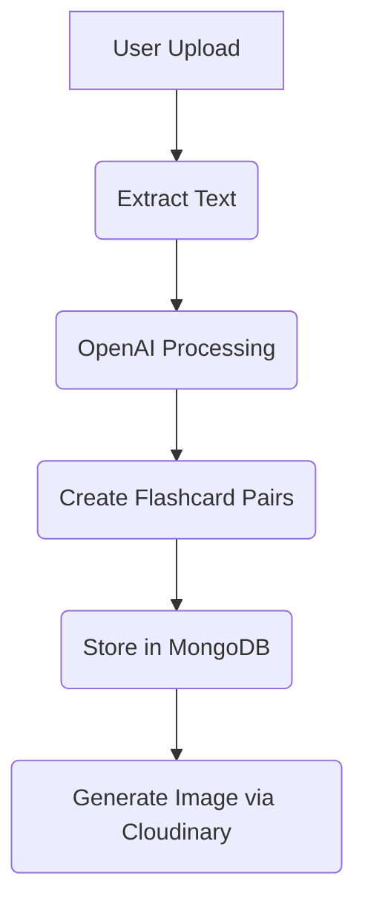

# AI Flashcard Generator 🚀

[](https://opensource.org/licenses/MIT)


An AI-powered web application that automatically generates downloadable flashcards from study materials (PDFs, TXT, .md files, or raw text) with smart filtering and cloud storage.

 <!-- Add actual path -->

## ✨ Key Features

- **AI-Generated Flashcards**  
  Convert study materials (PDF/TXT/.md/raw text) into Q&A flashcards using OpenAI
- **Multiple Export Options**  
  Download flashcards as high-quality images (customizable resolution)
- **Smart Organization**  
  - Advanced filtering by tags, dates, or keywords  
  - Full history of generated flashcards
- **Seamless Authentication**  
  Google OAuth + email/password login
- **Media Management**  
  Cloudinary integration for storing generated flashcard images

## 🛠 Tech Stack

| Component       | Technology |
|-----------------|------------|
| Frontend        | Next.js 13 (App Router), Tailwind CSS, React Hook Form |
| Backend         | Node.js, Express.js |
| Database        | MongoDB (Mongoose ODM) |
| AI              | OpenAI API |
| Storage         | Cloudinary |
| Authentication  | Next-Auth (Google OAuth + JWT) |
| State Management| React Context API |

## 🚀 Getting Started

### Prerequisites
- Node.js v18+
- MongoDB Atlas account
- OpenAI API key
- Cloudinary account
- Google OAuth credentials

### Installation

1. **Clone the repository**
   ```bash
   git clone https://github.com/LayuruLK/AI-Flashcard-Generator.git
   cd AI-Flashcard-Generator
   ```

2. **Install dependencies**
   ```bash
   npm install
   ```

3. **Environment Setup**  
   Create `.env` file with:
   ```env
   NEXT_PUBLIC_BACKEND_URL=http://localhost:3001
   MONGODB_URI=your_mongodb_uri
   OPENAI_API_KEY=your_openai_key
   CLOUDINARY_CLOUD_NAME=your_cloud_name
   CLOUDINARY_API_KEY=your_api_key
   CLOUDINARY_API_SECRET=your_api_secret
   GOOGLE_CLIENT_ID=your_google_client_id
   GOOGLE_CLIENT_SECRET=your_google_secret
   NEXTAUTH_SECRET=your_auth_secret
   ```

4. **Run the application**
   ```bash
   # Start frontend (Next.js)
   npm run dev

   # Start backend (in separate terminal)
   cd server
   npm start
   ```

## 🔧 How It Works

### 1. File Processing Pipeline


### 2. Authentication Flow
- JWT token stored in HTTP-only cookies
- Session management via Next-Auth
- Protected API routes

## 📚 Usage Guide

1. **Create Flashcards**
   - Upload a PDF/TXT/.md file or paste raw text
   - AI automatically generates question-answer pairs
   - Edit flashcards before saving

2. **Organize & Filter**
   ```bash
   Filter options:
   - By date range (createdAt)
   - By tags (user-defined)
   - Full-text search
   ```

3. **Export Options**
   - Download as PNG/JPEG (quality adjustable)
   - Copy text to clipboard
   - View in responsive web interface

## 🤝 Contributing

1. Fork the project
2. Create your feature branch (`git checkout -b feature/AmazingFeature`)
3. Commit changes (`git commit -m 'Add some feature'`)
4. Push to branch (`git push origin feature/AmazingFeature`)
5. Open a Pull Request

## 📜 License

Distributed under the MIT License. See `LICENSE` for details.

## 📧 Contact

Layuru Lakvidu Karunathilaka - [layurulakvidukarunathilaka@gmail.com](mailto:layurulakvidukarunathilaka@gmail.com)

Project Link: [https://github.com/LayuruLK/AI-Flashcard-Generator](https://github.com/LayuruLK/AI-Flashcard-Generator)
